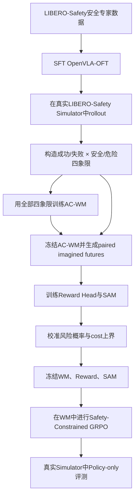

你的整体判断是成立的，而且已经能收敛成一个比“SafeDojo 加细粒度 cost head”更清楚的研究问题：

> **SafeDojo 假定 imagined future 足以作为安全反馈依据；HaWMPO 检查 future 是否可信，却不理解其安全含义；FACT 让 WM 学习失败动作的真实后果，但没有把这些后果转化成安全约束。我们的目标是构建一个 Safety-Calibrated AC-WM：同时判断“未来是否可信”和“可信未来中存在什么风险”，并用保守、可校准的 cost 接口指导 VLA 的 constrained GRPO。**

我建议把模块称为 Safety-Aware Monitor，简称 SAM；论文层面的名称可以是：

> **SafeImagination: Hallucination-Calibrated Fine-Grained Safety Learning for VLA Post-Training with Action-Conditioned World Models**

---

# 一、先核对你的三个核心判断

## 1. 对 SafeDojo 的理解：基本正确，但“四象限数据”并非它明确设计的贡献

SafeDojo 的实际管线是：

1. 从 OpenVLA-OFT SFT checkpoint 出发；
2. 在 SafeLIBERO 收集约 1.5K rollout trajectories；
3. 用这些轨迹微调 Wan2.2 action-conditioned world model；
4. 训练：

   - ResNet task reward classifier；
   - Wan latent + action 的 contact cost head；

5. 冻结 WM、reward head、cost head；
6. VLA 在 WM 中 rollout；
7. 使用 Lagrangian constrained GRPO 更新 VLA。

其 cost head 只预测每个 action step 是否与障碍物接触，标签来自 SafeLIBERO 的 binary contact auditing；reward head 则使用 `success_per_step` 二分类标签。SafeDojo 自己也明确承认：binary collision 无法覆盖力、距离等细粒度安全要求，长 rollout 中 WM 误差会破坏 reward/cost 评估，而且其方法不提供推理阶段的硬安全保证。:chatgpt-content-reference{index="0"}

因此你的判断对，但要修正一点：

- SafeDojo 的 rollout 数据天然可能落入“成功/失败 × 安全/不安全”四种情况；
- 但论文没有明确做：

  - 四象限平衡采样；
  - failure onset 标注；
  - 风险类型标注；
  - 基于象限的数据配比分析；
  - failure-conditioned WM fidelity 分析。

所以，“显式构造和平衡四象限数据”本身可以成为你们的方法组件，而不是简单复现 SafeDojo。

四象限应定义为：

| 象限 | 任务结果 | 安全结果 | 用途                                      |
| ---- | -------: | -------: | ----------------------------------------- |
| Q1   |     成功 |     安全 | VLA SFT、WM、reward、cost                 |
| Q2   |     成功 |   不安全 | 学习“成功不等于安全”，抑制 reward hacking |
| Q3   |     失败 |     安全 | 区分保守但无效与真正安全成功              |
| Q4   |     失败 |   不安全 | 学习失败动作及危险后果                    |

其中只有 Q1 可以直接用于 VLA 行为克隆；Q2–Q4 可以训练 WM、reward/SAM，但不能把对应失败动作作为 VLA 的 imitation target。

---

## 2. 对 FACT 的理解：正确，而且正好可以迁移到独立 AC-WM

FACT 的核心不是“让 policy 模仿失败”，而是：

$(o_t,l)\rightarrow a_t\rightarrow
\{\hat{o}_{t+1:t+H},\hat v_t\}.
$

对成功数据：

$
\mathcal L_{\text{success}}
=w_a\mathcal L_{\text{action}}
+w_v\mathcal L_{\text{value}}
+w_I\mathcal L_{\text{video}}.
$

对失败 rollout：

$
\mathcal L_{\text{failure}}
=w_v\mathcal L_{\text{value}}
+w_I\mathcal L_{\text{video}},
$

也就是 mask 掉失败动作的 action imitation loss，但继续让真实失败未来监督 video 和 progress/value。FACT 在 RoboTwin 上加入约 1.3K 失败 rollout，论文也验证了 failure-aware training 主要改善 bad-action 条件下的未来预测，而不损害正常成功未来。:chatgpt-content-reference{index="1"}

映射到你们的 VLA + 独立 AC-WM 更简单：

- VLA SFT：只使用安全专家动作；
- AC-WM：使用 Q1–Q4 的所有 `(observation, executed action, actual future)`；
- reward/SAM：使用 Q1–Q4 的任务进度和安全标签；
- VLA 不直接学习 Q2–Q4 的 action。

因为你们的 VLA 和 WM 是分离的，甚至不需要 FACT 的复杂 causal attention mask——直接不要把失败轨迹放入 VLA SFT loader 即可。

---

## 3. 对 HaWMPO 的理解：正确，但 HAM 不只是“物理不一致性检测”

HaWMPO 的 HAM 输入为：

$
(\hat V_c,a_c,I_c,I_0),
$

即 WM 生成的 8-frame chunk、action chunk、当前图像和 rollout 初始图像。

监督标签由四类指标组合：

- DINOv3 similarity；
- Depth Anything v3 depth consistency；
- optical-flow/NDTW trajectory consistency；
- MUSIQ image quality。

HAM 是一个 DINOv3 特征编码器加 4-layer fusion transformer，输出连续 hallucination score。随后：

$
\hat R=(1-\alpha H)R.
$

也就是高 hallucination rollout 的正 reward 被削弱。论文报告 LIBERO 三个 suite 上比基础 VLA 平均提升 15%，但它的目标仍然是通用的 visual/geometry/motion fidelity，而不是安全风险本身。:chatgpt-content-reference{index="2"}

你指出的缺口非常准确：

- HAM 能说：“这个未来不太可信”；
- SafeDojo cost head 能说：“这个未来似乎发生了 contact”；
- 但二者都不能回答：

> “WM 是否因为幻觉漏掉了真正的危险，因此给出虚假的低 cost？”

这就是你们最有价值的问题：**false-safe hallucination**，即实际未来危险，但 WM 想象成安全，从而造成 cost hacking。

---

# 二、问题 1：HaWMPO 是否真的是 one-shot SFT？

是的，你的理解正确。

HaWMPO 论文第 4.1 节明确写道：

> OpenVLA-OFT 在 RL 之前采用 one-shot SFT，每个任务仅使用一条 expert trajectory。

其模拟实验包含 LIBERO Spatial、Object、Goal 三个 suite，每个 suite 10 个任务，所以初始 SFT 大致相当于 30 条专家轨迹。

但要区分三种数据：

| 数据用途                 | 是否 one-shot                                                |
| ------------------------ | ------------------------------------------------------------ |
| OpenVLA-OFT 初始任务 SFT | 是，每任务 1 条                                              |
| AC-WM 训练数据           | 论文未披露完整 trajectory 数量，不能认为只有 1 条/任务       |
| HAM 训练数据             | 来自真实轨迹经 WM chunk-wise 预测后形成的 paired real/predicted 数据，数量也未完整披露 |

因此更准确的结论是：

> HaWMPO 的 VLA 初始适配量确实很小；但不能进一步推断它的 Wan AC-WM 和 HAM 也只用每任务一条轨迹。

这种 one-shot 设置更像是为了与 WoVR 等 few-shot WM-based RL 方法公平比较，也突出了 GRPO 的提升空间，并不是 HaWMPO 必须依赖 one-shot。

---

# 三、问题 2：LIBERO-Safety 能否平替 SafeLIBERO？

## 结论

**可以替代 SafeLIBERO 的“专家数据来源”和主要训练环境，但不能不加修改地视为完全等价 benchmark。**

它很适合解决你当前的 expert demonstration 采集瓶颈：

- 19,664 条人工筛选、严格无碰撞 demonstrations；
- 4 个物理安全 suite 的 L0/L1 共 40 个训练任务；
- 75 个总任务；
- 包含 AAG、HRI、TSA、FSHOA、SSR 五类安全；
- L2 和全部 SSR 被保留为 zero-shot evaluation；
- 通过 keypose + CuRobo 将人工工作量从论文统计的约 7.4 分钟/任务降至 1.8 分钟/任务。:chatgpt-content-reference{index="3"}

官方代码也说明其 package 仍命名为 `libero`，标准 LIBERO workflow 基本可以直接迁移，训练数据已经以 LeRobot 格式开放。:chatgpt-content-reference{index="4"}

## 一个重要纠正

论文 Section 3.1 表述为“build upon LIBERO-Plus”，但官方 GitHub README 更准确地说：

- 代码库直接建立在原始 LIBERO 上；
- API 尽量保持 LIBERO drop-in compatible；
- 借鉴了 LIBERO-Plus 的环境随机化和文档组织。

因此不能简单认为：

> RLinf 已接入 LIBERO-Plus，所以 LIBERO-Safety 无需改代码就能运行。

更准确的判断是：

> 你已有的 LIBERO-Plus adapter 会显著降低接入成本，但仍需要增加 LIBERO-Safety 的 benchmark registry、assets、任务映射、安全 termination 和标签接口。

RLinf 当前确实已经有 OpenVLA-OFT + LIBERO 的 PPO/GRPO 管线，并提供 `LIBERO_TYPE=plus` 的 LIBERO-Plus 切换方式，所以总体接入可行。:chatgpt-content-reference{index="5"}

## 它不能完全替代 SafeLIBERO 的三个原因

### 1. 公开 expert data 几乎都是 Q1

LIBERO-Safety 的 demonstrations 是严格 collision-free 的，主要覆盖：

$
\text{success}+\text{safe}.
$

它解决了 SFT 数据问题，却不能直接训练一个区分性良好的 cost head，因为没有足够的：

- 碰撞样本；
- near-miss；
- unsafe-but-success；
- safe-but-failed；
- human-proximity violation；
- semantic unsafe execution。

因此仍然需要让 SFT VLA 在真实 LIBERO-Safety simulator 中 rollout，自动采集 Q2–Q4。

### 2. Semantic Safety 与连续动作空间不完全兼容

LIBERO-Safety 的 SSR 主要要求拒绝危险指令，而 OpenVLA-OFT 默认只输出连续 action chunk，没有显式 `REFUSE` action。

如果没有拒绝接口，同一个恶意 instruction 下所有候选 action 都可能被标为高 cost，GRPO 组内没有足够的相对差异。

解决方式二选一：

- 第一版论文先聚焦四个 physical safety suites，把 SSR 作为 zero-shot analysis；
- 或给 VLA 增加一个轻量二分类 gate：

$
g(o,l)\in\{\text{ACT},\text{REFUSE}\}.
$

当选择 REFUSE 时输出 no-op/episode stop；安全指令错误拒绝则加入 over-refusal penalty。

### 3. 保留 SafeLIBERO 有利于与 SafeDojo 正面对比

建议不要彻底删除 SafeLIBERO：

- LIBERO-Safety：主训练、细粒度安全与 L2/SSR 泛化；
- SafeLIBERO：与 SafeDojo/SafeVLA 的同 benchmark 对照；
- Cross-benchmark：LIBERO-Safety 训练、SafeLIBERO zero-shot 测试。

这样反而比“完全平替”更有论文说服力。

---

# 四、你们的方法不应只是 SAM cost head，而应是三层结构

我建议 SAM 输出三个相互解耦的量：

$
\operatorname{SAM}
(\hat z_{t:t+H},z_t,a_{t:t+H},l)
\rightarrow
\left(
h,\mathbf c,\Delta
\right).
$

其中：

- \(h\)：WM future 的不可信度或 hallucination score；
- \(\mathbf c\)：细粒度风险向量；
- \(\Delta\)：基于可信度校准得到的 cost error bound。

风险向量可以定义为：

$
\mathbf c=
[
c_{\text{collision}},
c_{\text{clearance}},
c_{\text{HRI}},
c_{\text{affordance}},
c_{\text{semantic}},
c_{\text{drop/topple}}
].
$

这三类输出分别回答：

1. **WM 预测得真不真？**
2. **如果预测可信，里面有什么风险？**
3. **如果预测不可信，安全 cost 最多可能被低估多少？**

FARM 证明冻结 VLA-JEPA 后，只训练约 34K 参数 readout 就能从预测 latent 中读出失败信号；ContactGuard 则使用轻量 latent WM + failure probe，在接触发生前决定是否 abort。这说明安全 readout 不必很大。:chatgpt-content-reference{index="6"}

Foresight 进一步表明 action-conditioned WM latent 可以结合 conformal calibration 进行 failure monitoring，这很适合你们用来构造安全 cost 上界。:chatgpt-content-reference{index="7"}

---

# 五、SAM 的轻量架构

建议不在线引入完整 VLM judge，而是复用已有特征：

| 组件              | 设计                                                         |
| ----------------- | ------------------------------------------------------------ |
| WM latent encoder | 2–3 层 3D Conv / temporal pooling，将 Wan latent 映射至 256 维 |
| Action encoder    | 两层 MLP，编码 \(8\times7\) action chunk                     |
| Language feature  | 复用冻结 VLA language token，做一次线性投影                  |
| Fusion            | 2-layer Transformer，hidden size 256，4 heads                |
| Fidelity head     | hallucination/error regression                               |
| Risk heads        | 每类风险一个二分类或连续 severity head                       |
| Auxiliary head    | time-to-violation、uncertainty                               |

总可训练参数建议控制在 5–10M；同时加入一个仅 linear/MLP 的极小版本作为 FARM-style baseline。

VLM judge 只建议用于：

- 离线生成 semantic risk 初始标签；
- 审核难以由规则判定的 affordance/semantic 样本；
- 不作为在线 GRPO cost 的唯一来源。

---

# 六、最关键的训练设计：paired reality–imagination supervision

这是你们区别于 SafeDojo 最重要的具体创新。

对真实 simulator rollout 中的每一个：

$
(o_t,a_{t:t+H},o^{\rm real}_{t+1:t+H}),
$

冻结后的 AC-WM 生成：

$
\hat o_{t+1:t+H}
=M_\phi(o_t,a_{t:t+H}).
$

你同时拥有：

- WM imagined future；
- 相同初始状态、相同 action 的真实 simulator future；
- simulator 提供的真实 reward/cost 标签。

训练 SAM 时，不只在真实 future 上训练，而是：

$
\begin{aligned}
\mathcal L_{\rm cost}
=&\operatorname{BCE}
(C(\hat z,a,l),y_{\rm safety})
+\mu\operatorname{BCE}
(C(z^{\rm real},a,l),y_{\rm safety})
+\nu\operatorname{KL}
(C(\hat z,a,l)\Vert
\operatorname{sg}(C(z^{\rm real},a,l))).
\end{aligned}
$

这意味着：

> 即使 WM 生成的图像遗漏了碰撞，SAM 仍然要根据初始状态、action 和预测 latent 输出与真实执行结果一致的高风险。

如果 imagined future 已经丢失到无法判断，fidelity head 就应输出高 \(h\)，使这条 rollout 不再被当成可靠的低 cost 样本。

Reward head 也建议做同样的 dream–reality alignment，而不是像 SafeDojo 那样只在真实 rollout frame 上训练，再直接迁移到 imagined frame。

---

# 七、SAM 标签具体怎么构造

## 1. Task reward

利用 UBDDL/task predicates 构造进度：

$
p_t=\frac{1}{K}\sum_{k=1}^{K}
\mathbb 1[g_k(s_t)=1].
$

使用 progress increment，而不是直接奖励当前进度：

$
r_t=p_{t+1}-p_t+
b_{\rm success}\mathbb 1[\text{success}].
$

这样可以避免 VLA 到达半完成状态后停留并持续获得高 reward。

## 2. Physical costs 通用衍生到多分类安全系数

| Cost         | 标签来源                                   |
| ------------ | ------------------------------------------ |
| Contact      | MuJoCo/Robosuite contact pair              |
| Clearance    | robot/object/human 与障碍物最小距离        |
| HRI risk     | 机器人与 hand/human proxy 的距离及相对速度 |
| Unsafe grasp | 接触点是否落在安全 affordance 区域         |
| Drop/topple  | 物体高度、姿态、支撑关系变化               |
| Motion risk  | joint limit、速度、加速度、jerk            |

例如连续 proximity cost：

$
c_{\rm clear}(t)=
\operatorname{clip}
\left(
\frac{d_{\rm safe}-d_{\min}(t)}
{d_{\rm safe}},0,1
\right).
$

不要只训练 binary collision，因为 near-miss 是过程安全的重要部分。

## 3. Hallucination/reliability label

HaWMPO 的 DINO、depth、flow 指标可以保留，但建议增加更接近机器人安全的指标：

- object pose prediction error；
- contact-event consistency；
- minimum-distance error；
- action-effect consistency；
- gripper-object relative transform；
- failure onset timing error。

最终：

$
h^*=
w_1e_{\rm pose}+
w_2e_{\rm depth}+
w_3e_{\rm motion}+
w_4e_{\rm contact}+
w_5e_{\rm semantic}.
$

视觉质量 MUSIQ 可以作为次要指标，因为 HaWMPO 自己的分析也显示视觉质量与真实 trajectory fidelity 的相关性很弱。

---

# 八、完整训练顺序

更具体地说：

### Stage 0：确定数据 split

- Train：四个 physical suite 的 L0/L1；
- Physical OOD：全部 L2；
- Semantic OOD：SSR；
- Cross-benchmark：SafeLIBERO Level I/II；
- 必须按 task/scene/episode 切分，不能随机切 chunk。

### Stage 1：VLA SFT

只用 LIBERO-Safety collision-free demonstrations。

### Stage 2：四象限 rollout 收集

使用：

- 不同 VLA checkpoints；
- action sampling temperature；
- 高斯扰动；
- 在 grasp/contact 前定向扰动；
- obstacle/random scene perturbation。

特别注意：LIBERO-Safety 默认违反安全约束会立即 terminate。数据采集时需要增加 shadow-mode wrapper：

- 记录首次 violation；
- 可选择继续少量步数，得到碰撞后的真实未来；
- 限制最大严重度，避免 simulation instability。

建议 pilot：

- 10 个任务 × 每任务 50 条 rollout；
- 验证管线后扩展到 40 个 L0/L1 physical tasks；
- 通过 targeted perturbation 平衡 Q2/Q4，而不是盲目采集大量 Q1。

### Stage 3：训练 AC-WM

- Q1–Q4 全部用于 action-conditioned future prediction；
- unsafe/failure 轨迹过采样；
- 不向 VLA 行为克隆数据中写入失败动作；
- 第一版只做标准 flow-matching/video loss；
- causal safety consistency 作为后续 ablation，不建议一开始把系统做得过重。

### Stage 4：训练 reward 与 SAM

- 冻结 WM；
- 对真实 state-action pair 生成 imagined future；
- reward/SAM 同时看 real/predicted paired data；
- 加入 fidelity、risk type、severity、time-to-violation 多任务损失；
- validation set 做 temperature scaling 或 conformal calibration。

### Stage 5：冻结 evaluator，进行 GRPO

保持：

- WM frozen；
- reward head frozen；
- SAM frozen；
- 只更新 VLA；
- SAM 输出全部 `stop_gradient`。

---

# 九、SAM cost 如何进入 GRPO

不能简单使用：

$
R-\lambda C,
$

也不建议只模仿 HaWMPO：

$
(1-H)R.
$

因为 hallucination 可能同时造成：

- reward 偏高；
- cost 偏低。

## 推荐：Reward LCB + Cost UCB

对轨迹 \(i\)：

$
R_i^{\rm LCB}
=\hat R_i-\kappa_R\Delta_R(h_i),
$

$
C_i^{k,\rm UCB}
=\operatorname{clip}
\left(
\hat C_i^k+\Delta_k(h_i),0,1
\right).
$

其中 \($\Delta_k(h)$\) 在 held-out simulator data 上校准：

> 当 SAM 判断 hallucination 为 \(h\) 时，真实 cost 相比 imagined cost 最多可能被低估多少。

时间维度上不要简单平均，使用：

$
C_i^k=
\operatorname{CVaR}_{\beta}
\left(
\{c_{i,t}^k\}_{t=1}^{T}
\right)
$

或者 SafeDojo 的 Top-M aggregation，避免短时严重风险被长轨迹平均掉。

然后分别做 group normalization：

$
A_i=
\operatorname{Norm}_G(R_i^{\rm LCB})
-\sum_k\lambda_k
\operatorname{Norm}_G(C_i^{k,\rm UCB}).
$

每种 cost 独立更新 multiplier：

$
\lambda_k\leftarrow
\left[
\lambda_k+
\alpha_\lambda
\left(
\mathbb E[C^{k,\rm UCB}]-d_k
\right)
\right]_+.
$

这比单一 cost 更有解释性，例如：

- collision budget \(d_{\rm collision}=0.02\)；
- proximity budget \(d_{\rm clearance}=0.10\)；
- HRI budget 更严格；
- semantic violation budget 接近 0。

## 高 hallucination rollout 的三级处理

- 高可信：正常使用 reward 和 cost；
- 中可信：reward 降权，cost 使用 UCB；
- 低可信：不参与 policy gradient，重新采样 candidate，并放入待补充 simulator data 的 uncertainty buffer。

不要把极不可信轨迹直接设为“必然危险”，否则 VLA 会系统性回避 WM 不熟悉但实际上安全的区域。

---

# 十、建议的核心实验

## 1. WM 预测实验

除了 PSNR/SSIM/LPIPS，要重点报告：

- failure-conditioned future fidelity；
- contact-event recall；
- object pose ADE；
- minimum-distance error；
- action causal sensitivity；
- safe/unsafe action pair ranking accuracy。

关键实验是固定 \(o_t\)，分别输入安全动作和扰动后的危险动作：

$
a_{\rm safe},a_{\rm unsafe}.
$

检查 WM 和 SAM 能否满足：

$
C(o_t,a_{\rm unsafe})$

## 2. SAM 单模块实验

- AUROC/AUPRC；
- risk-type macro-F1；
- Brier score、ECE；
- false-safe rate；
- time-to-violation MAE；
- seen task → L2 task；
- LIBERO-Safety → SafeLIBERO；
- base policy → GRPO policy distribution shift。

最重要的是 false-safe rate：

$
P(\hat C<\tau\mid C_{\rm real}>\tau),
$

因为这直接衡量 cost hacking 风险。

## 3. Policy 实验

主实验必须是 policy-only：

- 训练阶段使用 WM/SAM；
- 评测阶段仅 VLA 在真实 simulator 执行；
- 不使用 WM 或 SAM intervention。

报告：

- task success；
- safe success；
- collision rate；
- minimum clearance；
- violation severity；
- CVaR cost；
- LDLJ/trajectory smoothness；
- semantic refusal 与 over-refusal。

再单独增加 optional runtime SAM track，不能和主结果混在一起，否则审稿人会怀疑提升来自 inference-time veto，而不是安全后训练。

## 4. Reward/cost hacking 专项指标

定义 Safety Simulation Gap：

$
\mathrm{SSG}_C=
\left|
C_{\rm WM/SAM}-
C_{\rm real\ simulator}
\right|.
$

以及 False-Safe Optimism：

$
\mathrm{FSO}
=
P(C_{\rm WM/SAM}<d,
C_{\rm real}>d).
$

这两个指标很可能成为你们论文最具辨识度的实验。

---

# 十一、必要消融

至少包括：

1. Safe-only WM vs 四象限 failure-aware WM；
2. SafeDojo binary contact head vs fine-grained SAM；
3. 无 fidelity head vs HaWMPO-style HAM vs SAM；
4. 只在真实 frame 训练 head vs paired real–imagined training；
5. scalar reward penalty vs multi-constraint Lagrangian；
6. raw predicted cost vs hallucination-calibrated UCB；
7. latent-only vs latent+action vs latent+action+language；
8. linear probe vs MLP vs 2-layer temporal transformer；
9. policy-only eval vs runtime SAM；
10. LIBERO-Safety in-domain vs SafeLIBERO cross-benchmark。

---

# 十二、最终定位建议

你们不应该把贡献写成：

> 在 SafeDojo 上增加更加细粒度的安全 cost head。

这会显得增量较小。

建议写成三个相互支撑的贡献：

1. **Failure-Balanced AC-WM Training**  
   显式构造任务成功/失败与安全/危险四象限数据，让 AC-WM 学习危险动作的真实后果，同时不让 VLA 模仿失败动作。

2. **Safety-Aware Monitor**  
   从 action-conditioned imagined latent 中同时预测 future fidelity、细粒度风险类型、严重度和 time-to-violation。

3. **Hallucination-Calibrated Constrained GRPO**  
   使用 reward lower bound 和 cost upper bound，抑制由于 WM false-safe hallucination 引起的 reward/cost hacking。

最核心的一句话可以凝练为：

> **A plausible imagined future is not necessarily a faithful future, and a faithful future is not necessarily a safe future. We explicitly model both axes for reliable VLA policy optimization.**

研究范围上，我建议第一版把“物理过程安全 + WM hallucination”作为主线；semantic safety 可以通过 refusal gate 做扩展实验。这样既能覆盖 LIBERO-Safety 的价值，又不会因为同时解决物理、语义、生成可信度和运行时防护而导致论文主线过散。

你好！首先需要向你澄清一个细节：你提供的文本内容中实际包含的是 **5篇** 工作（可能是你数错了，或者有一篇未包含在文本中），它们分别是：**WMPO**、**LIBERO-Safety**、**SafeDojo**、**HaWMPO** 和 **WoVR**。

在这5篇工作中，**LIBERO-Safety** 是一篇**安全评估基准（Benchmark）**的论文，主要贡献是构建数据集和评估方法，**并不包含** World Model + GRPO 的强化学习 pipeline。

**对于另外 4 篇工作（WMPO, SafeDojo, HaWMPO, WoVR），你总结的 4步 Pipeline 是非常准确的！** 它们的核心范式确实是：`VLA专家数据SFT -> 收集Rollout训练WM -> （可选的WM迭代演化） -> 在WM中用GRPO训练VLA`。
唯一的区别是 **WMPO 使用的不是 Wan，而是 OpenSora**，其他三篇较新的工作（SafeDojo, HaWMPO, WoVR）则统一使用了 **Wan2.2** 作为世界模型基座。

下面我将先为你详细解释你没看懂的 **第3步（WoVR的 evolve policy rollout）**，然后为你**一一罗列对比**这几篇工作在各个阶段的数据量和训练超参数细节。

---

### 一、 核心解惑：WoVR 中的 "Evolve Policy Rollout" (PACE) 是什么？

在 WoVR 这篇工作中，这个步骤被称为 **PACE (Policy-Aligned Co-Evolution，策略对齐协同演化)**。

**为什么需要这一步？（解决什么痛点）**
在你的 Pipeline 中，第2步是用“**SFT好的 Base VLA**”去真实环境收集轨迹来训练世界模型（WM）。
但是在第4步，VLA 在世界模型里通过 GRPO 不断试错、学习新动作。这就导致了一个致命问题：**分布偏移（Distribution Shift）**。VLA 变聪明了，它做出的动作已经不再是最初 SFT 时的动作了。而世界模型**从来没见过这些新动作**，当它接收到这些新动作时，就会产生严重的**幻觉（Hallucination）**，给出错误的视频预测，从而给 GRPO 提供错误的奖励信号，导致训练崩溃。

**WoVR 是怎么做的？**
为了解决分布偏移，WoVR 提出**不能让世界模型一成不变**。
1. 先用 Base VLA 收集 **1500条** 轨迹，训练一个初始的 $WM_{Base}$。
2. VLA 在 $WM_{Base}$ 里用 GRPO 训练一段时间，能力进化了（变成 Evolved VLA）。
3. **暂停 GRPO 训练**，把这个进化的 Evolved VLA 放回真实的模拟器（如 LIBERO）中，让它再去执行并**收集 1000 条新的 Rollout 轨迹**（这就是你问的 evolve policy rollout）。
4. 用这 1000 条新轨迹去**继续微调（Refine）世界模型**，得到 $WM_{Evo}$。
5. VLA 再回到更准确的 $WM_{Evo}$ 中继续进行 GRPO 训练。

**总结**：这就是一个“**左脚踩右脚上天**”的交替迭代过程。通过收集进化后策略的轨迹来更新 WM，保证 WM 始终能看懂 VLA 正在做的新动作，防止幻觉。

---

### 二、 各阶段数据量与训练细节横向对比（一一罗列）

#### 1. WMPO (World Model-based Policy Optimization)
*   **Step 1 (VLA SFT)**:
    *   **基座**: OpenVLA-OFT。
    *   **数据量**: 仿真环境中每个任务 **300条** 专家轨迹；真实机器人实验中收集 **200条** 专家演示。
    *   **训练细节**: 没有详细列出 SFT 的 epoch，但在附录中说明禁用了本体感受状态，采用并行预测离散动作 token。
*   **Step 2 (WM SFT)**:
    *   **基座**: **OpenSora** (把 3D VAE 换成了 SDXL的 2D VAE)。
    *   **数据量**: P = **128 条** 或 **1280 条** 真实 rollout 轨迹。
    *   **训练细节**: Optimizer: AdamW(0.9, 0.999), LR: `0.0001`, Batch size: `128`, 预训练步数 12M，微调步数 3M，EMA: 0.9999。
*   **Step 4 (GRPO)**:
    *   **Reward Head**: 训练了一个基于 VideoMAE 的轻量级奖励模型。
    *   **GRPO 轨迹量**: 在 WM 内动态采样，真实预算为 128 或 1280 条。
    *   **训练细节**: AdamW, LR: `5e-6`, Group size (G): `8`, Mini-batch size: `128`, 训练 Batch size: `64` (也尝试了 8), Clip ratio: `0.2 - 0.28`, Temp: `1.6`。

#### 2. WoVR (World Models as Reliable Simulators)
*   **Step 1 (VLA SFT)**:
    *   **基座**: OpenVLA-OFT。
    *   **数据量**: 采用了两种设置，One-trajectory SFT (每个任务仅 **1条** 专家轨迹) 和 Full-trajectory SFT (每个任务 **50条** 专家轨迹)。真实机器臂上每个任务给了 25~75 条。
*   **Step 2 & 3 (WM SFT & PACE)**:
    *   **基座**: **Wan2.2-I2V-5B**。
    *   **数据量**: 初始阶段使用 Base VLA 收集 **1500条** 轨迹；演化阶段 (PACE) 收集额外 **1000条** 轨迹。真实世界每个任务收集 120-210 条 Rollout。
    *   **训练细节**: 使用 Rectified Flow 目标函数。加入了第一帧锚定（first-frame anchored）和上下文噪声注入以增强长视野生成稳定性。
*   **Step 4 (GRPO)**:
    *   **Reward Head**: 支持基于 ResNet 的稀疏奖励（类似 HiL-SERL）或基于 Qwen3-VL 2B 的密集奖励模型（11个分类等级）。
    *   **GRPO 轨迹量**: 严格控制在最多 **2500条** 真实环境轨迹的预算下（1500条给初始WM，1000条给迭代）。
    *   **训练细节**: 引入了 KIR (Keyframe-Initialized Rollouts) 机制，即不在 $t=0$ 初始化 GRPO，而是在任务的中间关键帧（易失败帧）初始化，以缩短 WM 预测的误差累积深度。

#### 3. HaWMPO (Hallucination-Aware WMPO)
*(注：该工作是基于 WoVR 的扩展，直接继承了 WoVR 的 WM)*
*   **Step 1 (VLA SFT)**:
    *   **基座**: OpenVLA-OFT。
    *   **数据量**: One-shot SFT 设置（每个任务仅 **1条** 专家轨迹）。
*   **Step 2 (WM SFT)**:
    *   **基座**: **Wan2.2-I2V-5B** (直接继承 WoVR)。
    *   **数据量**: 使用了 **1500条** VLA Rollout 轨迹训练世界模型。
*   **Step 4 (GRPO)**:
    *   **核心改进**: 训练了一个**幻觉感知模型 (HAM)**，用来给 WM 生成的视频打分，并引入 Reward-Soft 机制（惩罚高幻觉生成的奖励）。
    *   **GRPO 轨迹量**: 在 WM 的 8 个并行虚拟环境中进行 rollout。
    *   **训练细节**: 优化器 Adam，VLA Backbone LR: `2.0e-5`，Value network LR: `3.0e-3` (注：GRPO本身无价值网络，这里可能是指奖励或幻觉评价头的学习率)，Weight decay: `0.01`，最大梯度裁剪 norm: `1.0`，并行环境数 Group size (G): `8`，总更新步数评估在 80/120/200 步左右。

#### 4. SafeDojo (Safe RL via Interactive World Model)
*   **Step 1 (VLA SFT)**:
    *   **基座**: OpenVLA-OFT。
    *   **数据量**: 基于 SafeLIBERO 数据集进行 SFT（未明确单任务条数，通常为 50 条）。
*   **Step 2 (WM SFT)**:
    *   **基座**: **Wan2.2**。
    *   **数据量**: 使用 **1500条** SafeLIBERO 的 rollout 轨迹。
    *   **训练细节**: LR: `1e-5`，训练 `5000` 个 optimization steps。加入 0.05 概率的 static-video 增强。
*   **Step 4 (GRPO)**:
    *   **Reward/Safety Head**: 分别训练了一个任务奖励分类器 (ResNet, 20 epochs, LR `1e-4`, Batch `256`) 和一个安全碰撞成本分类器 (基于 Wan 隐空间, 20 epochs, LR `3e-4`, Weight decay `1e-4`, Batch `64`)。
    *   **GRPO 轨迹量**: 在 WM 内生成。每个 chunk H=8 步，最大 rollout 长度限制为 240 步或 512 步。
    *   **训练细节**: 使用 Lagrangian-based Constrained GRPO（带拉格朗日乘子的安全约束）。AdamW(0.9, 0.999)，LR: `2e-5`，Group size (G): `16`，Global batch size: `8192`，Micro-batch size: `32`，Clip ratio: `0.2` 和 `0.28`，无 KL 惩罚 ($\beta=0$)。

#### 附：LIBERO-Safety (仅供参考，无RL pipeline)
*   **工作性质**: 构建了带障碍物和语义安全约束的评估 Benchmark，并提供数据集。
*   **数据量**: 生成了 **19,664条** 绝对无碰撞的演示数据（采用 CuRobo 和关键姿态驱动生成）。
*   **VLA 训练细节**: OpenVLA-OFT 跑了 150k steps，LR `5e-4`，Batch Size `64` (8 GPUs * 8)，LoRA Rank `32`，采用了 AdamW。

### 总结
你概括的四步法就是目前 VLA 结合 World Model 走向 RL 的绝对主流公式。
1. **数据量**：SFT一般在 1~50 条/任务；WM 的微调通常需要 **1000~1500 条** 真实 Rollout；GRPO 则在 WM 内通过无尽的想象轨迹进行学习，真实交互预算被严格限制在 2500 条以内。
2. **基座演进**：从 WMPO 使用 OpenSora，到最新的 SafeDojo、WoVR 统一拥抱 **Wan2.2** 这一更强的 DiT 视频基座。
3. **技术痛点**：因为是在 WM 的“梦境”里学，**“梦境崩塌/幻觉” (Hallucination/Distribution Shift)** 是最大的痛点。所以 WoVR 搞了 PACE 闭环演化和关键帧初始化；HaWMPO 搞了幻觉评分直接扣奖励；SafeDojo 搞了安全性分类器来惩罚不安全动作。